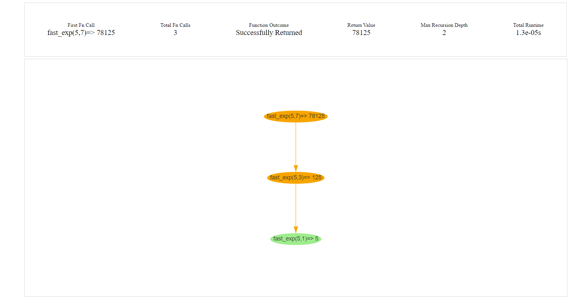
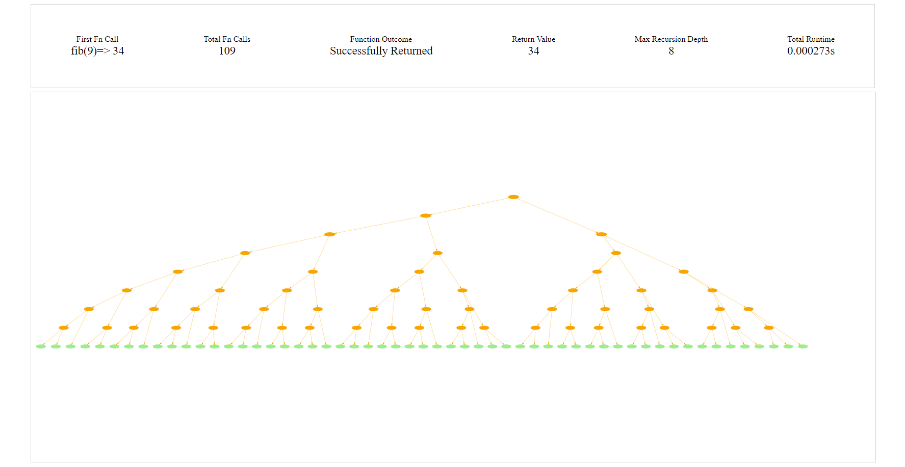

# Description

`draw_recursion` is a python package that exposes
a single decorator publicly (really a decorator factory to be technically correct): `track_recursion`.

The decorator can then be applied to any recursive function. The decorator will track the entire call tree of the recursive function. The default behavior is that when the function returns, the tree of recursive calls is dumped as an `HTML` file into the directory `htmlreports`.

Each `htmlreport` draws the entire call tree of the recursive call, as well as some other metrics such as maximum recursion depth, total runtime, total number of recursive calls, and the final return value.
The recursive call tree is interactive. If the function failed with an uncaught exception, then the exact depth and call that triggered the exception is recorded in the tree.

Under the hood, the python code builds out a string representing the call tree in [DOT language](<https://en.wikipedia.org/wiki/DOT_(graph_description_language)>). The `HTML` file uses [vis.js](https://visjs.org/) to parse the DOT string and build out an interactible graph. Because it uses `HTML` & `JavaScript`, the dependencies required for visualization are essentially zero as long as you have a browser.

## Examples

An easy usage example is as follows:

```python

@track_recursion()
def fast_exp(n: int, exp: int):
    """
    Efficient recursive function for computing exponentials
    by exploiting the fact that n**exp == (n**exp/2) ** 2
    """
    if exp == 1:
        return n
    if exp % 2 == 0:
        return fast_exp(n, exp/2) ** 2
    # In the odd case, we need an extra n
    # to offset the floor divide
    return n * fast_exp(n, exp//2) ** 2

fast_exp(5,7)
```

After the function is run, a file at `./htmlreports/fast_exp_v1.html` will have been created, which will look like this:



---

A second example with a more complex call tree would be
the classic recursive fibonacci without any memoization:

```python
@track_recursion(report_stdout=True)
def fib(n: int):
    """
    Classic Fibonacci recursive algorithm without memoization.
    """
    if n < 2:
        return n
    return fib(n-1) + fib(n-2)

fib(9)
```

After the function completes, the generated HTML file will look like this:


---

The trees are interactible, and can be zoomed in to see more details. The
call signature `fib(9) -> 34` means that the function call to `fib(9)` returned the value `34`. If a function never returns due to an uncaught exception, then the return value is an exclamation point: `!`.

### Decorator Notes

---

The full call signature of the decorator `track_recursion` is as follows:

```python
def track_recursion(
        report_stdout: bool = False,
        report_html: bool = True,
        kwargs_to_ignore: Iterable[str] | None = None
        ):

```

1. `report_stdout`: If `True`, a printout with some metadata about the recursive function call is given when the function completes.
2. `report_html`: If `True`, builds a summary `HTML` file visualizing the recursive call tree.
3. `kwargs_to_ignore`: Hides a kwargs from being visualized in the call tree. This is especially useful when using dictionaries for memoization, where printing a dictionary at every node makes the tree unreadable.

### Future Roadmap

---

I plan to work on allowing animation in the HTML files so that the progression of the calls can be watched like a movie in the future. This would just be JavaScript added to the HTML files, not Python.
